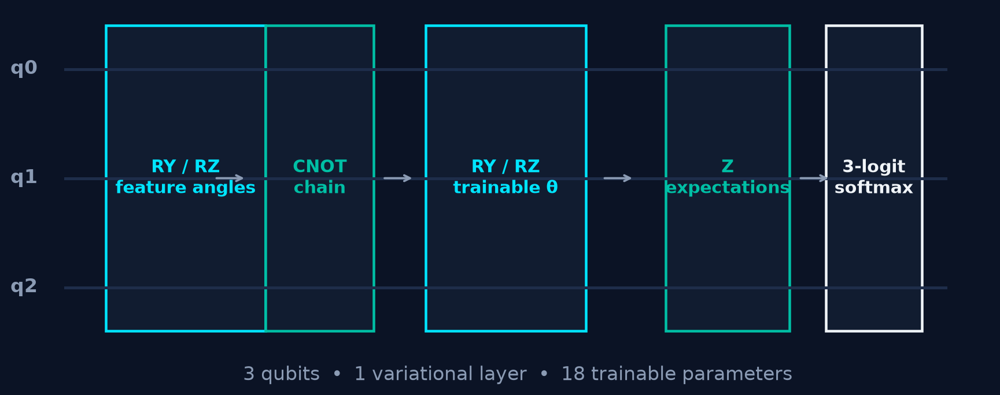
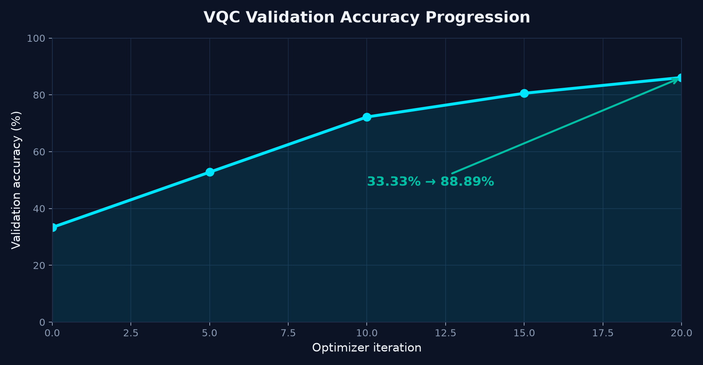
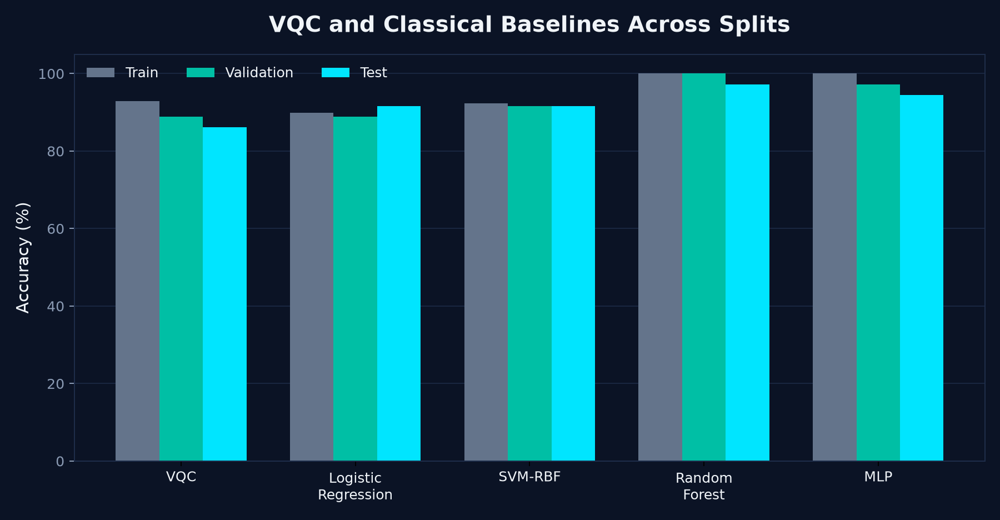

# VQC Nonlinear Cybersecurity PoC

## Variational Quantum Classification on Nonlinear Manifolds

### Architecture, Optimization, and Cybersecurity-Inspired Threat Classification

[](https://github.com/saviochackoxavier-tech/vqc-nonlinear-cyber-poc)
[](https://www.python.org/)
[](https://qiskit.org/)
[](results_baseline_comparison.csv)

> A transparent, reproducible hybrid quantum–classical research prototype for learning a controlled three-class nonlinear manifold—and for testing the VQC honestly against classical machine-learning baselines.

**Author:** Savio Chacko Xavier  
**Programme:** MCA Cybersecurity Student, Department of Computer Applications, Mahatma Gandhi University, Kottayam  
**ORCID:** [0009-0004-6363-2619](https://orcid.org/0009-0004-6363-2619)

---

## The headline result

The corrected VQC learns the nonlinear benchmark substantially above the 33.33% chance level, reaching **86.11% held-out test accuracy**. However, the classical baselines perform better on this experiment:

| Model | Validation accuracy | Held-out test accuracy | Test macro F1 |
|---|---:|---:|---:|
| **Random Forest** | **100.00%** | **97.22%** | **0.972** |
| **MLP** | **97.22%** | **94.44%** | **0.944** |
| **SVM-RBF** | **91.67%** | **91.67%** | **0.918** |
| **Logistic Regression** | **88.89%** | **91.67%** | **0.915** |
| **VQC** | **88.89%** | **86.11%** | **0.862** |

### The scientifically correct interpretation

This repository does **not** claim quantum advantage. It demonstrates that a carefully specified three-qubit VQC can learn a controlled nonlinear decision structure under exact statevector simulation. The baseline comparison establishes the necessary context: on this synthetic benchmark, conventional models are more accurate.

That is the point of the project. A quantum machine-learning result should be reproducible, fairly compared, and explicit about its limits.

---

## Visual overview

### VQC architecture



The model uses three qubits, data re-uploading, a nearest-neighbor CNOT chain, three Pauli-Z expectation values, and a trainable three-logit softmax readout. The complete model has **18 trainable parameters**.

### Training progression



Validation accuracy increased from **33.33% at initialization** to **88.89% after bounded optimization**. The optimizer reached its iteration limit, so this should be interpreted as successful training within a defined budget—not proof of a global optimum.

### Full comparison across data splits



The classical comparison uses exactly the same engineered features and the same stratified train/validation/test partitions as the VQC.

---

## Why this project exists

Cybersecurity telemetry can contain curved, interacting, and non-axis-aligned decision geometry. A model that succeeds on a simple linear threshold does not necessarily demonstrate that it can learn a nonlinear structure. This project therefore begins with a controlled synthetic manifold so that the data geometry, feature engineering, quantum circuit, optimizer, and evaluation protocol can be inspected end to end.

The project is intentionally scoped as a **proof of concept**. It is not an operational intrusion-detection system, does not use proprietary network data, and does not demonstrate performance on a quantum processing unit.

The framework is designed to support future experiments involving:

- network-flow and threat-family classification;
- encrypted-traffic metadata analysis without payload inspection;
- lightweight anomaly-monitoring research for constrained IoT environments;
- public intrusion-detection datasets such as UNSW-NB15 and CIC-IDS2017;
- resource-performance studies across qubit count, circuit depth, shots, and noise.

---

## Research questions

1. Can a balanced synthetic dataset be constructed with genuinely nonlinear, interpretable class geometry?
2. Can a correctly specified three-qubit VQC learn that structure under statevector simulation?
3. Does the VQC outperform strong classical baselines when every model receives the same information and evaluation splits?

The measured answer is:

- **Yes** to the first question.
- **Yes** to the second question.
- **No, not on this benchmark** to the third question.

---

## System architecture

```mermaid
flowchart LR
    A[Warped radial manifold\n240 samples / 3 balanced classes] --> B[Stratified split\n168 train / 36 validation / 36 test]
    B --> C[Training-only\nstandardization]
    C --> D[Nonlinear feature engineering\nradial + interactions + quadratic contrast]
    D --> E[Three bounded quantum angles]
    E --> F[Three-qubit VQC\nRY/RZ + CNOT chain]
    F --> G[Pauli-Z expectation values\n3 quantum features]
    G --> H[Trainable affine readout\n3 logits + softmax]
    H --> I[Cross-entropy + L2 loss]
    I --> J[L-BFGS-B optimizer]
    J --> K[Validation + held-out test evaluation]
```



### Quantum model

```text
Encoded angles
      │
      ▼
┌─────────────┐   ┌──────────────┐   ┌──────────────────┐
│ RY / RZ     │ → │ CNOT chain   │ → │ trainable RY/RZ │
│ data upload │   │ q0–q1–q2     │   │ variational θ   │
└─────────────┘   └──────────────┘   └──────────────────┘
                                              │
                                              ▼
                                  ⟨Z0⟩, ⟨Z1⟩, ⟨Z2⟩
                                              │
                                              ▼
                                  3-logit affine readout
                                              │
                                              ▼
                                       one softmax
```

---

## Dataset: a nonlinear manifold, not a linear threshold

The benchmark contains **240 observations**, equally divided into three classes. Each class is generated around a distinct radial centre, with angular warping and small perturbations:

- class centres approximately at radii 0.55, 1.10, and 1.65;
- nonlinear angular warp: \(\phi' = \phi + 0.22\sin(3\phi) + 0.10r^2\);
- two Cartesian coordinates from the warped radius and angle;
- two nonlinear nuisance telemetry coordinates;
- four total input features;
- fixed seed: `17`;
- class balance: `80 / 80 / 80`.

The split is stratified:

| Partition | Samples | Purpose |
|---|---:|---|
| Training | 168 | Fit preprocessing, circuit, and classical models |
| Validation | 36 | Monitor model selection and training behaviour |
| Test | 36 | Final held-out evaluation only |

Standardization is fitted on the training partition and applied unchanged to validation and test data. This prevents information from the evaluation partitions leaking into preprocessing.

---

## The corrected VQC design

The earlier prototype contained two important issues: its label rule was primarily linear, and its readout truncated an eight-state quantum distribution to three entries before applying another softmax. The current implementation fixes both problems.

### Corrected feature path

1. Standardize the four synthetic features using training data only.
2. Build three nonlinear bounded features from radial magnitude, feature interactions, and quadratic contrasts.
3. Map those features to bounded rotation angles.
4. Re-upload the angles through a three-qubit circuit.
5. Measure three Pauli-Z expectation values.
6. Apply a trainable affine three-class readout.
7. Apply one softmax to obtain class probabilities.

### Corrected probability definition

The VQC does **not** treat three arbitrarily selected basis-state probabilities as a probability vector. Instead, it constructs quantum features:

\[
z_q(x,\theta)=\langle \psi(x,\theta)|Z_q|\psi(x,\theta)\rangle,
\qquad q\in\{0,1,2\}.
\]

Those features are mapped to three logits:

\[
\ell_k = w_k^Tz+b_k,
\qquad k\in\{0,1,2\},
\]

and one softmax defines the final probabilities:

\[
p_k = \frac{e^{\ell_k}}{\sum_j e^{\ell_j}}.
\]

### Optimization

The model is trained with multiclass cross-entropy plus a small L2 penalty. Optimization uses:

- `L-BFGS-B`;
- deterministic central finite-difference gradients;
- fixed random seed `17`;
- maximum 20 optimizer iterations;
- a deterministic optimization subset of up to 120 training observations for statevector tractability;
- independent validation monitoring;
- final held-out test evaluation after parameter selection.

---

## Classical baselines

The repository compares the VQC with four classical models:

- **Logistic Regression** — linear reference baseline;
- **SVM-RBF** — nonlinear kernel baseline;
- **Random Forest** — ensemble decision-tree baseline;
- **MLP** — compact feed-forward neural baseline.

Every model uses the same train/validation/test partitions and the same three engineered features. The comparison is deliberately simple and transparent. It is not an exhaustive hyperparameter sweep.

### Interpretation of the ranking

The Random Forest is strongest on the current benchmark, followed by the MLP, SVM-RBF, logistic regression, and VQC. This is expected to be possible because concentric nonlinear structure can be learned efficiently by classical models. The result means the VQC is a working research prototype, not a winner on this task.

---

## Installation

### Requirements

- Python **3.10 or newer**
- `pip`
- A local Jupyter environment or Google Colab
- No quantum hardware required
- Statevector simulation runs on a CPU, but training can be computationally intensive

### Clone the repository

```bash
git clone https://github.com/saviochackoxavier-tech/vqc-nonlinear-cyber-poc.git
cd vqc-nonlinear-cyber-poc
```

### Create and activate a virtual environment

#### Linux or macOS

```bash
python3 -m venv .venv
source .venv/bin/activate
python -m pip install --upgrade pip
```

#### Windows PowerShell

```powershell
py -m venv .venv
.venv\Scripts\Activate.ps1
python -m pip install --upgrade pip
```

### Install dependencies

```bash
pip install -r requirements.txt
```

The principal packages are:

- `qiskit` for quantum circuits and statevector simulation;
- `numpy` and `pandas` for numerical and tabular processing;
- `scikit-learn` for preprocessing, classical baselines, and evaluation;
- `scipy` for L-BFGS-B optimization;
- `matplotlib` for plots;
- `jupyter`, `nbformat`, and `nbclient` for notebook execution.

---

## Execution instructions

### Option A: Run interactively in Jupyter

```bash
jupyter notebook Improved_VQC_Nonlinear_Manifolds_Cybersecurity.ipynb
```

or:

```bash
jupyter lab Improved_VQC_Nonlinear_Manifolds_Cybersecurity.ipynb
```

Run the cells from top to bottom. The notebook generates the dataset, trains the VQC, evaluates the VQC, fits the classical baselines, and displays the comparative diagnostics.

### Option B: Run in Google Colab

1. Open [Google Colab](https://colab.research.google.com/).
2. Select **File → Upload notebook**.
3. Upload `Improved_VQC_Nonlinear_Manifolds_Cybersecurity.ipynb`.
4. Run all cells.

The notebook is self-contained and procedurally generates its synthetic benchmark; no private CSV or external cybersecurity log is required.

### Option C: Execute headlessly

To execute the notebook without opening a browser:

```bash
jupyter nbconvert \
  --to notebook \
  --execute Improved_VQC_Nonlinear_Manifolds_Cybersecurity.ipynb \
  --output executed_vqc_notebook.ipynb \
  --ExecutePreprocessor.timeout=1800
```

For reproducible CI-style execution, the notebook uses a fixed seed. Exact runtime may vary with Qiskit, SciPy, CPU, and Python versions.

### Inspect the result table

```bash
python - <<'PY'
import pandas as pd
results = pd.read_csv('results_baseline_comparison.csv')
print(results[results['split'].eq('test')].sort_values('accuracy', ascending=False))
PY
```

---

## Repository contents

```text
.
├── README.md
├── Improved_VQC_Nonlinear_Manifolds_Cybersecurity.ipynb
├── docs_ssrn_proof_of_concept.md
├── results_summary.md
├── results_baseline_comparison.csv
├── requirements.txt
├── assets/
│   ├── baseline_comparison.png
│   ├── vqc_architecture.png
│   └── vqc_training_progression.png
└── .gitignore
```

### Main files

| File | Purpose |
|---|---|
| `Improved_VQC_Nonlinear_Manifolds_Cybersecurity.ipynb` | Executed research notebook containing the data generator, VQC, optimizer, baselines, metrics, and plots |
| `results_baseline_comparison.csv` | Machine-readable train/validation/test metrics for all five models |
| `docs_ssrn_proof_of_concept.md` | Full SSRN-style proof-of-concept manuscript |
| `results_summary.md` | Concise technical summary of the corrected experiment |
| `assets/` | README diagrams and measured charts |
| `requirements.txt` | Python dependency list |

---

## Reproducibility checklist

- [x] Fixed random seed documented: `17`
- [x] Balanced class construction documented
- [x] Stratified train/validation/test split documented
- [x] Training-only standardization documented
- [x] Quantum readout defined mathematically
- [x] Optimization method and iteration budget documented
- [x] Classical baselines included
- [x] Held-out test set reported
- [x] Limitations stated explicitly
- [ ] Repeated-seed confidence intervals
- [ ] Public intrusion-detection dataset evaluation
- [ ] Real QPU execution and noise analysis

The final three items are intentionally future work rather than hidden assumptions.

---

## Limitations and responsible interpretation

This project should not be presented as a production intrusion-detection system. The current evidence is limited by:

1. **Synthetic data:** the benchmark is cybersecurity-inspired, not an operational network dataset.
2. **Small sample size:** the final test partition contains only 36 observations.
3. **Low input dimension:** four features do not represent the full complexity of production cybersecurity telemetry.
4. **Statevector simulation:** the experiment does not model QPU noise, measurement shots, calibration drift, or hardware connectivity constraints.
5. **Bounded optimization:** a deterministic subset of training observations is used to make finite-difference statevector optimization tractable.
6. **Fixed baseline configurations:** the classical models are fair reference points, not an exhaustive hyperparameter search.
7. **No quantum advantage:** classical models outperform the VQC on this benchmark.

The responsible conclusion is that the repository provides a transparent foundation for testing hybrid quantum classification—not evidence that VQCs are already superior for cybersecurity.

---

## Future research roadmap

### Phase 1 — Statistical strengthening

- Repeat the experiment across multiple random seeds.
- Report means, standard deviations, confidence intervals, and paired comparisons.
- Add ablations for data re-uploading, entanglement, nonlinear feature engineering, and readout design.
- Tune all baselines using validation-only model selection.

### Phase 2 — Cybersecurity data

- Evaluate on a documented public intrusion-detection dataset such as UNSW-NB15 or CIC-IDS2017.
- Apply duplicate checks, leakage checks, class-imbalance handling, and feature provenance documentation.
- Use time-aware evaluation where timestamps are available.

### Phase 3 — Quantum resource study

- Compare qubit counts and variational depths.
- Measure circuit depth, transpilation overhead, shot budget, and simulator runtime.
- Inject realistic noise models.
- Execute the circuit on IBM Quantum or another available QPU.
- Test whether any benefit appears under a clearly defined resource constraint.

---

## Citation

If this repository supports your work, cite the accompanying proof-of-concept manuscript and identify the experiment as a synthetic benchmark study. A BibTeX entry can be added after the manuscript receives a stable public identifier.

```bibtex
@misc{xavier_vqc_nonlinear_cyber_poc_2026,
  author       = {Xavier, Savio Chacko},
  title        = {Variational Quantum Classification on Nonlinear Manifolds: A Reproducible Proof-of-Concept for Cybersecurity-Inspired Threat Classification},
  year         = {2026},
  howpublished = {GitHub repository},
  note         = {Synthetic benchmark; statevector simulation; classical baseline comparison},
  url          = {https://github.com/saviochackoxavier-tech/vqc-nonlinear-cyber-poc}
}
```

---

## Author

**Savio Chacko Xavier**  
MCA Cybersecurity Student  
Department of Computer Applications  
Mahatma Gandhi University, Kottayam  
ORCID: [0009-0004-6363-2619](https://orcid.org/0009-0004-6363-2619)

---

## Final note

> **The value of this project is not an unsupported claim that quantum models have already won. Its value is a reproducible experiment that makes the quantum model, its limitations, and its classical comparison visible.**
